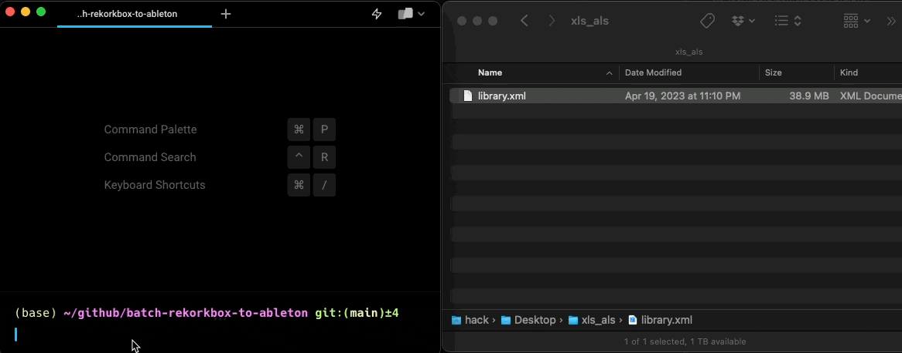

# Batch Convert Rekordbox Cue Points to Ableton Warp Markers

> 🚧 Currently, only splitting the Rekordbox `Library.xml` to individual track XML files is completed.  🚧

This project allows you to split your exported Rekordbox XML file into individual XML files for each song. Each XML file will contain track information and cue points which can be used to set Ableton warp markers.



## Features

- Parses Rekordbox XML library file
- Creates individual XML files for each track containing cue points
- Automatically handles invalid file name characters

## Requirements

- Python 3.x
- Rekordbox XML library file

## Usage

1. Set the `input_file` variable to the path of your Rekordbox XML library file.
2. Set the `output_folder` variable to the desired location for the individual track XML files.
3. Run the `rb_to_als.py` script using Python 3.x.

```bash
python3 rb_to_als.py
```

4. The script will process each track in your Rekordbox `library.xml` file and generate individual XML files containing track information and cue points.
5. Use these XML files to set Ableton warp markers for your tracks.

## TODO

- [ ] Automate creating Ableton `.als` project files for each song so that we can batch convert Rekordbox cue points to Ableton warp markers with `convert_cuepoints.py`
- [ ] Add support for Rekordbox phrases

## Example

For instance, if your Rekordbox XML library file is located at `~/Desktop/xls_als/library.xml` and you want to save individual track XML files to `~/Desktop/xls_als/tracks`, simply set the `input_file` and `output_folder` variables as follows:

```python
input_file    = os.path.expanduser('~/Desktop/xls_als/library.xml')
output_folder = os.path.expanduser('~/Desktop/xls_als/tracks')
```

Run the script, and it will generate individual XML files in the specified output folder for each track in your Rekordbox library.

## Disclaimer

This script is provided "as is" and any expressed or implied warranties are disclaimed. Always backup your Rekordbox library and Ableton projects before using this script.

This project takes inspiration from the following [gist](https://gist.github.com/sandhose/b6903fe3bca799063300cce28832dfdc) and has been adapted for batch processing individual songs.


## Contributing

Contributions are welcomed! This project follows the all-contributors spec. ([emoji key](https://github.com/all-contributors/all-contributors#emoji-key)):

<!-- ALL-CONTRIBUTORS-BADGE:START - Do not remove or modify this section -->
[](#contributing)

<!-- ALL-CONTRIBUTORS-BADGE:END -->

<!-- ALL-CONTRIBUTORS-LIST:START - Do not remove or modify this section -->
<!-- prettier-ignore-start -->
<!-- markdownlint-disable -->

<!-- markdownlint-restore -->
<!-- prettier-ignore-end -->

<!-- ALL-CONTRIBUTORS-LIST:END -->

## License

MIT - see [LICENSE](./LICENSE) for more details.

If you found this project interesting, please consider [sponsoring me](https://github.com/sponsors/itsbrex) or <a href="https://twitter.com/itsbrex">following me on twitter </a>